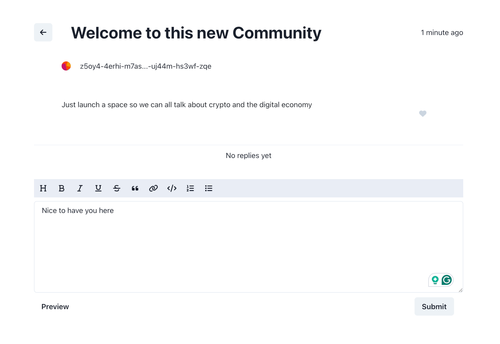
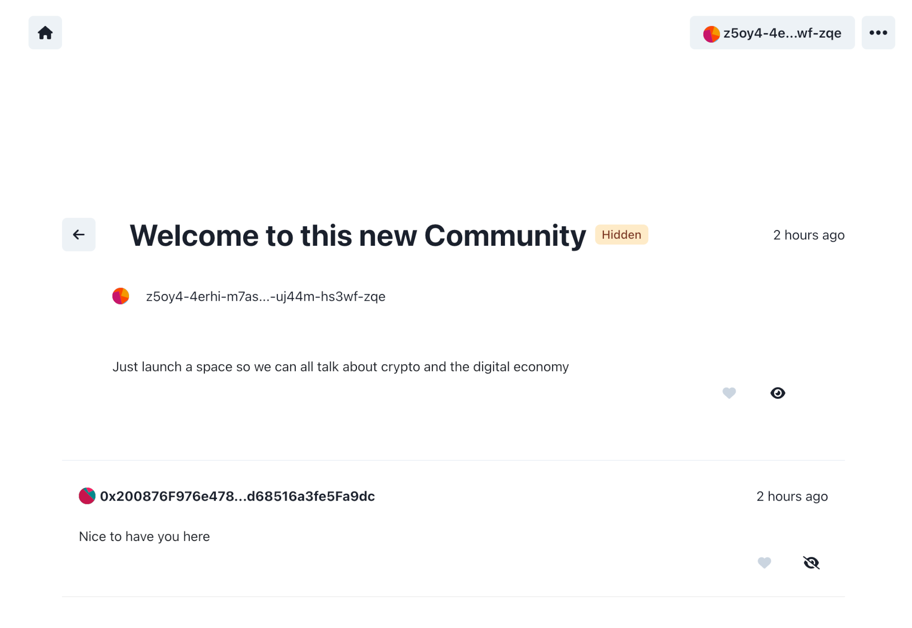

<h1 align="center">Communities.ooo</h1>

<h4 align="center">Create communities on the <a href="https://internetcomputer.org/" target="_blank">Internet Computer</a>.</h4>

<p align="center">
  <a href="#overview">Overview</a> •
  <a href="#screenshots">Screenshots</a> •
  <a href="#how-it-works">How it works</a> •
  <a href="#run-locally">Run locally</a> •
  <a href="#faq">FAQ</a>
</p>

## Overview


"Communities" is a tool that creates online communities owned by the creators. They can invite their followers, fans or readers to their community to discuss, share ideas and interact. Users can login with their Ethereum, Solana or IC account using the standard browser extensions.

[](https://www.communities.ooo/)

Today, creators build and interact with their fan base on third-party platforms. We believe they should truly own the space they created, literally, in their wallet.

## Screenshots

<p>
  
  
  <br/>
  
   
</p>

## How it works

<details>
<summary>Deploying a community</summary>

<br/>

To achieve complete ownership of a community we require that there's a special canister (the parent) that deploys the community canisters (the children). The parent right now is controlled by us and could be autonomous in the future. When a creator creates a new community a couple things happen in the background. First the creator [transfers ~0.10$ in ICP + 10%](https://github.com/LiveDuo/communities/blob/ed5ebdba098359e726a4649d0b6231a1143fe85a/src/_parent/frontend/store/parent.js#L78) to account for the operation. When the [transfer is done](https://github.com/LiveDuo/communities/blob/master/src/_parent/backend/create_child.rs#L20), a new canister is created and then [the frontend assets are uploaded](https://github.com/LiveDuo/communities/blob/ed5ebdba098359e726a4649d0b6231a1143fe85a/src/_parent/backend/create_child.rs#L123) to the canisters. After the upload the child canister is ready and ownership of that newly created canister is [transferred](https://github.com/LiveDuo/communities/blob/ed5ebdba098359e726a4649d0b6231a1143fe85a/src/_parent/backend/create_child.rs#L183) from the parent canister to the creator. At that point the creator has complete ownership of the community as a canister controller.

</details>


<details>
<summary>Databases, tables and indexes</summary>

<br/>

As this project is relational by nature, simple key-store data structures wouldn't cut it. Instead we needed data structures that are very similar to conventional SQL databases. For that reason we implemented a relational-style databases using tables, relations and indexes in the Internet Computer. More specifically, [tables](https://github.com/LiveDuo/communities/blob/ed5ebdba098359e726a4649d0b6231a1143fe85a/src/_child/backend/state.rs#L261) a maps from record id to record data, [relations](https://github.com/LiveDuo/communities/blob/ed5ebdba098359e726a4649d0b6231a1143fe85a/src/_child/backend/state.rs#L170) are two-way ordered maps from a record id of one table to a record id of another table and indexes are either [maps](https://github.com/LiveDuo/communities/blob/ed5ebdba098359e726a4649d0b6231a1143fe85a/src/_child/backend/state.rs#L246) or [ordered maps for ordered data](https://github.com/LiveDuo/communities/blob/ed5ebdba098359e726a4649d0b6231a1143fe85a/src/_child/backend/state.rs#L250). Note that when we first design our database, stable memory was not mature enough so we are using heap memory at the moment but the same design applies to stable memory as well.

</details>


<details>
<summary>Custom domains</summary>

<br/>

To assign a custom domain a creator has to enter that domain from "Custom domain" modal and then added the displayed DNS records to their DNS registrar. Behind the since a [request is made to the backend](https://github.com/LiveDuo/communities/blob/4c64419705825013e716a0afcdd0870293ff6ced/src/_child/backend/domain.rs#L111) that starts the domain registration process. First the domain is [stored in the database](https://github.com/LiveDuo/communities/blob/4c64419705825013e716a0afcdd0870293ff6ced/src/_child/backend/domain.rs#L167) and a TXT file is the [hosted in the canister](https://github.com/LiveDuo/communities/blob/4c64419705825013e716a0afcdd0870293ff6ced/src/_child/backend/domain.rs#L154) for  the Internet computer to verify. Every 6 hours, [a timer is trigger](https://github.com/LiveDuo/communities/blob/4c64419705825013e716a0afcdd0870293ff6ced/src/_child/backend/domain.rs#L122) in the canister that notifies the Internet computer about the newly registered domain, then if the DNS records are set correctly the Internet computer allows that domain to be used for that canister. If that request succeeds the domain is [marked as "done" in the database](https://github.com/LiveDuo/communities/blob/4c64419705825013e716a0afcdd0870293ff6ced/src/_child/backend/domain.rs#L90) otherwise the error is stored and is shown to the creator once they open the "Custom domain" modal again.

</details>


<details>
<summary>Community upgrades</summary>

<br/>

As every creator deploys their own canister we built a system to coordinate opt-in upgrades through the parent canister which works as follows. Upgrades are [uploaded](https://github.com/LiveDuo/communities/blob/ed5ebdba098359e726a4649d0b6231a1143fe85a/src/_parent/backend/lib.rs#L313) to the parent canister and creators can see new upgrades in the "Upgrade Modal" and decide if they want to upgrade their communities. If they do, the community canister [requests from parent canister](https://github.com/LiveDuo/communities/blob/ed5ebdba098359e726a4649d0b6231a1143fe85a/src/_parent/backend/lib.rs#L283) and [stores the upgrade files](https://github.com/LiveDuo/communities/blob/ed5ebdba098359e726a4649d0b6231a1143fe85a/src/_child/backend/upgrade.rs#L56) including the new frontend assets and the new canister wasm file. Then the [upgrade starts in the background](https://github.com/LiveDuo/communities/blob/ed5ebdba098359e726a4649d0b6231a1143fe85a/src/_child/backend/upgrade.rs#L124) which calls the management canister to perform the upgrade with the new wasm file. Lastly, After the upgrade is done the frontend assets are [replaced](https://github.com/LiveDuo/communities/blob/ed5ebdba098359e726a4649d0b6231a1143fe85a/src/_child/backend/upgrade.rs#L153) with the new frontend assets. Note that one version can have multiple upgrade paths that we call tracks.

</details>


<details>
<summary>Web3 logins</summary>

<br/>

To make communities accessible from end users this project supports authentication with Ethereum and Solana browser extensions. When a user clicks the login button a new principal is created for them in the background and the credentials of this principal are stored in their browser. Then their wallet extension pops up requiring them to sign a [specific message with their wallet](https://github.com/LiveDuo/communities/blob/ed5ebdba098359e726a4649d0b6231a1143fe85a/src/_child/frontend/store/child.js#L334). When they do, that message is [send to the backend](https://github.com/LiveDuo/communities/blob/ed5ebdba098359e726a4649d0b6231a1143fe85a/src/_child/backend/lib.rs#L85) where [both the content of the message is checked](https://github.com/LiveDuo/communities/blob/ed5ebdba098359e726a4649d0b6231a1143fe85a/src/_child/backend/lib.rs#L92) and the address that signed it. If a user clear their cookies or want to sign in from another divide they just have to start this process again and a new principal is created for them but is linked to the same profile.

Note: We implement Ethereum and Solana login before [ic-siwe](https://github.com/kristoferlund/ic-siwe) and [ic-siws](https://github.com/kristoferlund/ic-siws). If you are looking to add this functionality to your project you might want to check these libraries too. They utilise [delegations](https://internetcomputer.org/docs/current/references/ic-interface-spec#authentication) to have a consistent principal among logins.

</details>


<details>
<summary>ICRC standards</summary>

<br/>

Since one of that major goals of the project was to own communities as NFTs, we had to [made the project compliant](https://github.com/LiveDuo/communities/blob/feature/custom-domains/src/_child/backend/icrc7.rs) with either [DIP721](https://github.com/Psychedelic/DIP721) or [ICRC7](https://github.com/dfinity/ICRC/blob/main/ICRCs/ICRC-7/ICRC-7.md) standards and from various discussions with community members we decided on the latter. Since the ICRC7 standard is not fully adopted yet by wallets and marketplaces this feature is not tested in real conditions yet. This feature will be revised once these parties adopt the standard further.

</details>


## Run locally

This project depends on:

1. `node` and `npm` for frontends and scripts

2. `rust`, `cargo` and `dfx` for backends


<details>
<summary>Start the `parent` canister</summary>

<br/>

```sh
npm i # install deps

dfx start --clean # separate terminal
dfx deploy parent

npm run upload:parent
npm run dev:parent
```

</details>


<details>
<summary>Start the `child` canister</summary>

<br/>

```sh
npm i # install deps

dfx start --clean # separate terminal
dfx deploy child

npm run dev:child
```

</details>

## FAQ

<details>
<summary>What does community ownership means?</summary>

<br/>

New communities are owned and controlled from your Internet Computer wallet.

If you owned a community you have special privilege to assign moderators, take the community offline or transfer the ownership to another person if you wish to.

</details>

<details>
<summary>Where are communities hosted if no servers are involved?</summary>

<br/>

All communities run on the Internet Computer. They are assigned a subnet of 13 nodes that takes care of hosting the service. When user create a post, sends a reply or uploads a picture all nodes should come in consensus over the result of that operation.

Since there isn't anyone in the middle, server costs can only be increased by Internet Computer onchain governance.

</details>

<details>
<summary> How do I manage my community?</summary>

<br/>

The wallet that created a community is assigned the "Admin".

They will be able to hide replies they deemed inappropriate, lock posts and assign other moderators to have these special privileges too.

</details>
<br/>

## Contributors

<a href="https://github.com/liveduo/communities/graphs/contributors">
  
</a>

Made with [contributors-img](https://contrib.rocks).  

## Acknowledgments

We maintained a fork of [`ic-certified-assets`](https://github.com/dfinity/sdk/tree/master/src/canisters/frontend/ic-frontend-canister) (later renamed to `ic-frontend-canister`). Credits to its original creators.
