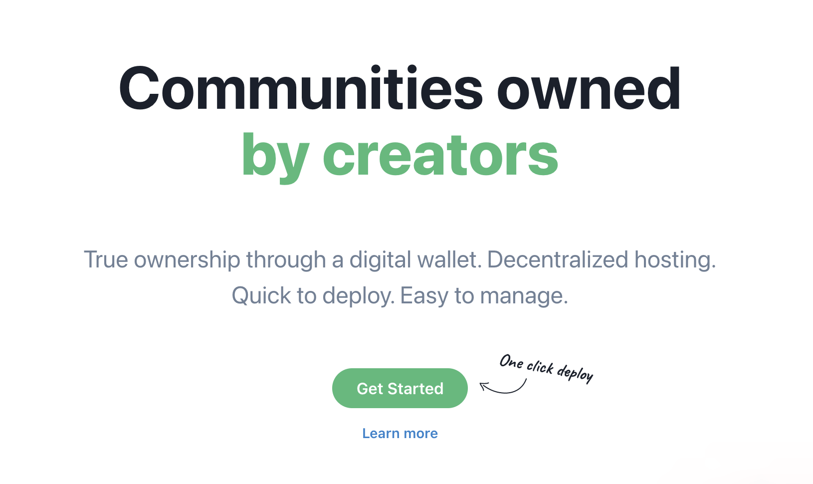
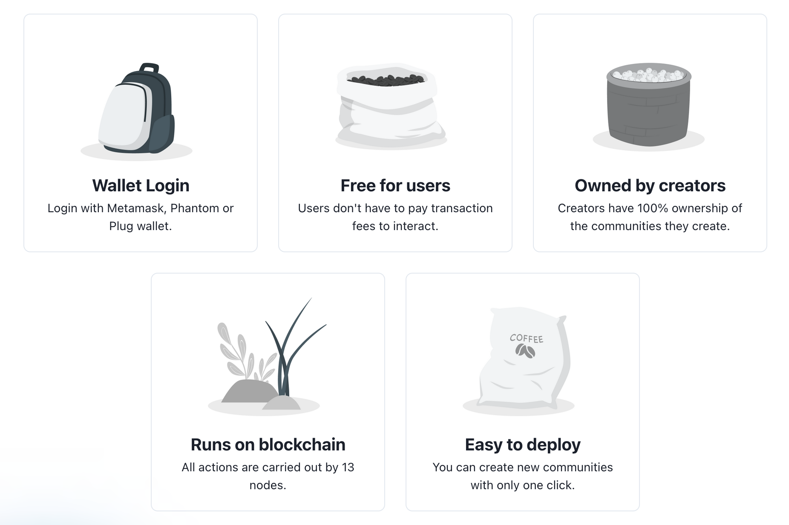
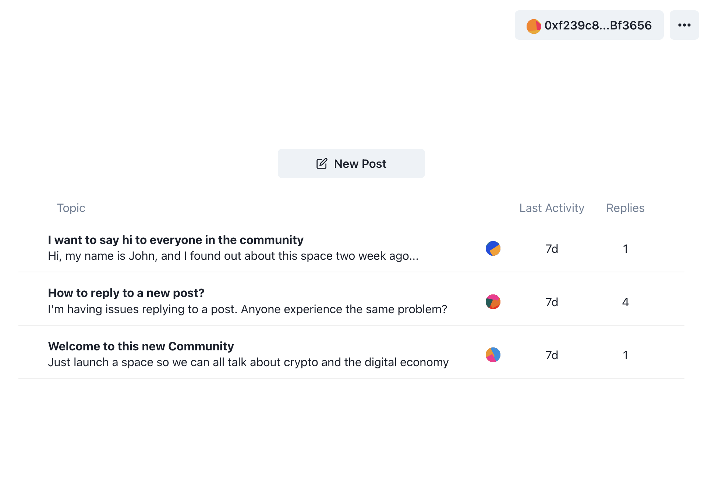
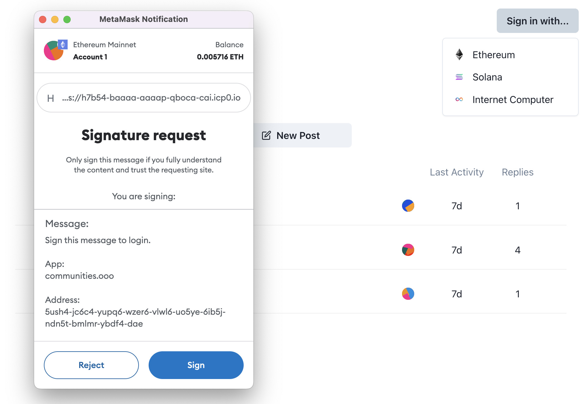

<h1 align="center">Communities.ooo</h1>

<h4 align="center">A tool that creates online communities on the <a href="https://internetcomputer.org/" target="_blank">Internet Computer</a>.</h4>

<p align="center">
  <a href="#features">Features</a> •
  <a href="#screenshots">Download</a> •
  <a href="#how-it-works">How it works</a> •
  <a href="#development">Development</a> •
  <a href="#faq">FAQ</a>
</p>



"Communities" is a tool that creates online communities owned by the creators. They can invite their followers, fans or readers to their community to discuss, share ideas and interact. Users can login with their Ethereum, Solana or IC account using the standard browser extensions.



Today, creators build and interact with their fan base on third-party platforms. We believe they should truly own the space they created, literally, in their wallet.

## Screenshots

<p>
  
  
  <br/>
  
   
</p>

## How it works (TODO)

- Deployment (parent-child wasm + frontend)
- Database (Btreemaps)
- Custom domains (DNS IC nodes)
- Upgrades (parent structs)
- Web3 login (Ethereum / Solana)
- ICRC Compliance (ICRC3/7)

+ Include diagrams
+ Include links to code

## Run locally

This project depends on:
- `node/npm`
- `rust/cargo`
- `dfx`

Start the `parent` canister:

```sh
npm i # install deps

dfx start --clean # separate terminal
dfx deploy parent

npm run upload:parent
npm run dev:parent
```

Start the `child` canister:

```sh
npm i # install deps

dfx start --clean # separate terminal
dfx deploy child

npm run dev:child
```

## FAQ

<details>
<summary>What does community ownership means?</summary>

<br/>

New communities are owned and controlled from your Internet Computer wallet.

If you owned a community you have special privilege to assign moderators, take the community offline or transfer the ownership to another person if you wish to.

</details>

<details>
<summary>Where are communities hosted if no servers are involved?</summary>

<br/>

All communities run on the Internet Computer. They are assigned a subnet of 13 nodes that takes care of hosting the service. When user create a post, sends a reply or uploads a picture all nodes should come in consensus over the result of that operation.

Since there isn't anyone in the middle, server costs can only be increased by Internet Computer onchain governance.

</details>

<details>
<summary> How do I manage my community?</summary>

<br/>

The wallet that created a community is assigned the "Admin".

They will be able to hide replies they deemed inappropriate, lock posts and assign other moderators to have these special privileges too.

</details>
<br/>

## Contributors

<a href="https://github.com/liveduo/communities/graphs/contributors">
  
</a>  

Made with [contributors-img](https://contrib.rocks).  

## Acknowledgments

We maintained a fork of [`ic-certified`](https://github.com/dfinity/sdk/tree/master/src/canisters/frontend/ic-frontend-canister) (renamed to `ic-frontend-canister`). Credits go to its original creators.
